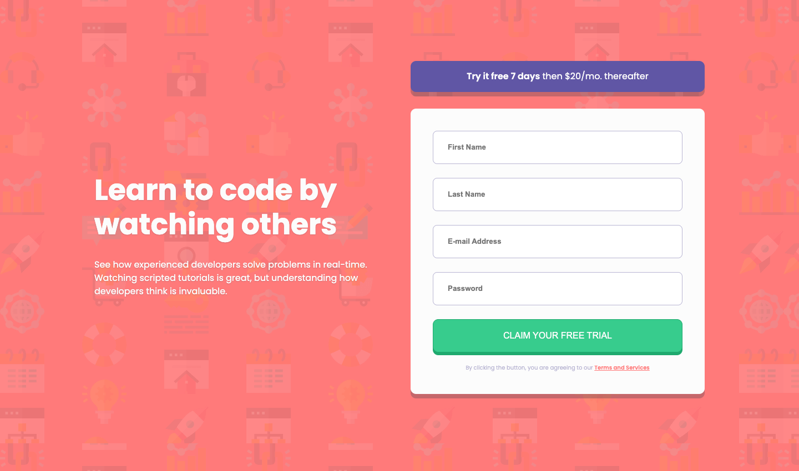

# Frontend Mentor - Intro component with sign up form

### Design Preview

This is a solution to the [Intro component with sign up form challenge on Frontend Mentor](https://www.frontendmentor.io/challenges/intro-component-with-signup-form-5cf91bd49edda32581d28fd1). Frontend Mentor challenges help you improve your coding skills by building realistic projects. 

## Table of contents

- [Overview](#overview)
  - [The challenge](#the-challenge)
  - [Screenshot](#screenshot)
  - [Links](#links)
- [My process](#my-process)
  - [Built with](#built-with)

## Overview

### The challenge

- Build out the project to the designs provided

### Screenshot

### Links

- Solution URL: [https://github.com/sjneri/intro-signup](https://github.com/sjneri/intro-signup)
- Live Site URL: [https://sjneri.github.io/intro-signup/](https://sjneri.github.io/intro-signup/)

## My process

### Built with

- Semantic HTML5 markup
- CSS custom properties
- Flexbox
- jQuery